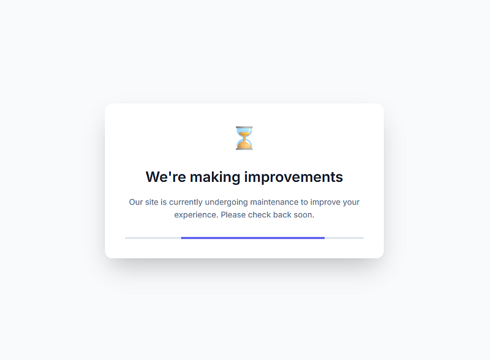

# OopsKit

### Maintenance pages for your website

A simple, responsive maintenance page that informs visitors when your website is undergoing maintenance or updates. The page features a modern design with both light and dark mode support.

## Preview

When active, visitors will see a friendly message indicating that the site is under maintenance




## Usage with Cloudflare

If you're using Cloudflare for your site, you can use the GH Pages url as the redirected landing page when your site is under maintenance.

_This is a great way to keep your entire site: pages, assets, API et al. offline while you work on the maintenance._

1. Go to your Cloudflare dashboard and create a new page rule under Rules > Page Rules.
2. Set the page rule url to *.yoursite.com/ * and the destination URL to the GH Pages url (https://thinkdj.github.io/oopsKit/) so that all requests to your site are redirected to the maintenance page. 

3. Set the redirect type to "302 - Temporary Redirect".
4. Save the page rule and disable it when your site is no longer under maintenance.

## Alternate usage

If you're not using Cloudflare, you can still use this page as a temporary landing page when your site is under maintenance by self hosting it on your own server.

1. Temporarily replace your main index file with `index.html` during maintenance periods
2. Customize the message and styles directly in `index.html` to match your brand if needed

## File Structure

```
├── index.html          # Main HTML file (includes embedded styles)
└── README.md           # Documentation
```

## Customization

### Changing the Message

Edit the text in `index.html`:

```html
<h1>We'll Be Right Back</h1>
<p>Our site is currently undergoing maintenance...</p>
```

### Modifying Colors

The color scheme can be customized via CSS variables near the top of the `<style>` block in `index.html`. The file includes both light and dark mode color variables.

## Browser Support

- ✅ Modern browsers (Chrome, Firefox, Safari, Edge)
- ✅ Mobile browsers
- ✅ Dark mode support through `prefers-color-scheme`

## License

Feel free to use this maintenance page for your projects. Attribution is appreciated but not required.


> 🕊️
